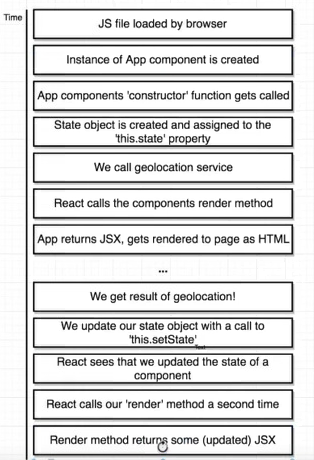
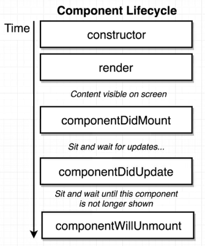

# Intro:

## 9 - Project Directory:


## 12 - Components:
- A component can either be a Function or a Class
- Primary purpose of a component is to produce HTML (i.e. jsx) to show the user
- Secondary purpose is to handle feedback from the user using Event Handlers

# Building Content with JSX

## JSX and Babel:
- Babel converts non-ES5 javascript code into ES5

| ES6 code   |
|------------|
```js
var App = function App() {
    return React.createElement("div", null, "Hi there!");
};
```
| Babel-converted ES5 code   |
|----------------------------|
```js
var App = function App() {
    return React.createElement("div", null, "Hi there!");
};
```


## JSX vs HTML:
| HTML Code  |
|------------|
```html
<div>
    <label class="label" for="name">Enter name:</label>
    <input id="name" type="text"/>
    <button style="background-color: blue; color:white">Submit</button>
</div>
```
| JSX code   |
|------------|
```js
<div>
    <label className="label" for="name">Enter name:</label>
    <input id="name" type="text" />
    <button style={{backgroundColor: 'blue', color: 'white'}}>Submit</button>
</div>
```

- By **REQUIREMENT**, JSX must use double-quotes for a string (e.g. "label", "name" etc)
- By **COMMUNITY CONVENTION**, use single-quotes for any non-JSX property

- When referring to styling, JSX has traditionally used `className` instead of `class`, though reasons for this are just legacy at this point
- JSX can access Javascript properties using curly-brackets:
  - If wanting to access JS **Objects** within JSX, they need to either be:
    - Referred explicitly if wanting to retreive their value (e.g. someObject.foo)
    - Assigned to another property (e.g. className = someObject)


# Communicating with Props

## Three Tenets of Components
- Component Nesting: a component can be shown inside of each other
- Component Re-usability: components should be easily re-usable
- Component Configuration: components should be customisable when they're created (when re-using components)

## Free CSS Styling from Semantic
- semantic-ui.com offers free css styles for common components
- To use these:
  - https://cdnjs.com/libraries/semantic-ui
  - copy https://cdnjs.cloudflare.com/ajax/libs/semantic-ui/2.4.1/semantic.min.js
  - Add the following line inside <head> of index.html:
    - <link rel="stylesheet" href="https://cdnjs.cloudflare.com/ajax/libs/semantic-ui/2.4.1/semantic.min.css" />

## Fake Data / Assets Generation:
- https://github.com/marak/Faker.js/ can be used to generate fake data and images
- To use within a react project:
  - `npm install --save faker` -> installs but also adds the module to package.json for future need
  - `import faker from 'faker';`
  - See documentation and use as a 'path' to generating the required data, e.g.
  - NOTE: ensure the final string is given () to signify a method call

## Creating a Re-usable and Configurable Component:
- Identify the JSX that appears to be duplicated
- What is the purpose of that block of JSX? Think of a descriptive name for what it does
- Create a new file to house this new component - it should have the same name as the component
- Create a new component in the new file, paste the JSX into it
- Make the new component configurable by using React's 'props' system

## props.children
- `props.children` contains any properties passed through a component. This can be used to pass through components within other components, e.g:
```js
<ApprovalCard>
    <CommentDetail image={faker.image.avatar()} author="Bob ross" date="Today at 16:44pm" content="nice paints"/>
</ApprovalCard>
```


# Class-based Components

## Retrieving a User's Geolocation:
- see https://developer.mozilla.org/en-US/docs/Web/API/Geolocation_API
```js
window.navigator.geolocation.getCurrentPosition(
    position => console.log(position), // SUCCESS CASE CALLBACK
    err => console.log(err) // FAILURE CASE CALLBACK
);
```

## State:
- Rules of State:
  - Only usable with class components (although can be used within functional components through hooks)
  - State is a JS object that contains data relevant to a singular component
  - Updating State causes the component to (almost) instantly render
  - State must be initialized when a component is created
  - State can **only** be updated using the function `setState`



# Lifecycle Methods:



- constructor:
  - automatically called when a new instance of the component is created
  - can be used for initial data loading
- render:
  - is **NOT-OPTIONAL** -> is called directly after Constructor
  - should only render and return JSX and nothing else
- componentDidMount:
  - is called (only once) when this component is first rendered onto the screen
  - can be used for initial data loading -> **PREFERRED** to data load using this instead of 'constructor' out of convention
- componentDidUpdate:
  - is called automatically every time the component updates itself (either state updates or new props are passed in)
  - can be used for data loading for every update the would occur
- componentWillUnmount:
  - is called (only once) when component is stopped to be rendered on the screen
  - used for clean-up

## State and Constructor
- state can be defined without a Constructor in ES6. Babel then converts it to ES5 syntax without the need for us to explicitly define it, i.e:

```js
state = { lat: null, errorMessage: '' };
```
is equal to:
```js
constructor(props) {
    super(props);
    this.state = { lat: null, errorMessage: '' };
}
```

# Javascript 'this'

## Problem caused by this:

- Using `this` inside of a class would refer to a class object. e.g:
```js
class SearchBar {
    onFormSubmit(){
        // some code
    }

    render() {
        return (
            <div>
                <form onSubmit={this.onFormSubmit}> // 'this' refers to 'SearchBar'
                </form>
            </div>
        )
    }
}
```
- No matter where in the class, `this` will always refer to the class itself EXCEPT when used within a function of the class.
- When `this` is used within a function, it refers to the object on which the function was called, e.g:
```js
class Car {
    setDriveSound(sound) {
        this.sound = sound;
    }

    drive() {
        return this.sound;
    }
}
const car = new Car();
car.setDriveSound('vroom'); // `setDriveSound()` is called on an object of Car, therefore `this` refers to Car (Car.setDriveSound)
car.drive(); //`drive()` is called on the object '
```
- for `car.setDriveSound()`: `this` within `setDriveSound()` would refer to `car`
- for `car.drive()`: `this` within `drive()` would refer to `car`
- The output of the above is 'vroom'


## Solutions:

### 1 - Bind:
```js
class Car {
  constructor () {
    this.drive = this.drive.bind(this);
  }

	setDriveSound(sound) {
   this.sound = sound;
  }

  drive() {
   return this.sound;
  }
}

const car = new Car();
car.setDriveSound('vroom');

const drive = car.drive;
drive()
```
- A constructor is added and binds `this` to `drive()`
- We're therefore explicitly ensuring that whenever `this` is used within `drive()` method, it refers to `Car`
- `this.drive = this.drive.bind(this)` -> overwrites `this.drive` to equal `this.drive.bind(Car)`


### 2 - Arrow Bind:
- Originally:
```js
class SearchBar extends React.Component {
    state = { term: '' };

    onFormSubmit(event) {
        console.log(this.state.term);
    }
}
```

- After Fix:
```js
class SearchBar extends React.Component {
    state = { term: '' };

    onFormSubmit = (event) => {
        console.log(this.state.term);
    }
}
```
- `onFormSubmit` is now an arrow function. This automatically binds `this` used within the function to `SearchBar`


### 3 - Specifying Arrow Bind directly within Handler:

```js
class SearchBar extends React.Component {
    state = { term: '' };

    onFormSubmit(event) {
        console.log(this.state.term);
    }

    render() {
        return (
            <div className="ui segment">
                <form onSubmit={(event) => this.onFormSubmit(event)}>
                </form>
            </div>
        );
    };
}
```
- Above we specify an Arrow Bind inline where it needs to be
- `(event)` invokes `this.onFormSubmit(event)` only once during a submit. `this` in this instance is correctly referred to the class (i.e. `SearchBar`)

# Event Handling

## Creating an Event Handler

- Event listeners can be added to allow user input
- This is done with 2 parts:
  - A property on an HTML component which detects if a change has occurred (and calls the listener method)
  - A listener method which is called by an HTML component

e.g:

```js
onInputChange() {
    // code which does something
}
render() {
    return (
        <input type="text" onChange={this.onInputChange}/>
    )
}

```
- NOTE: `onInputChange` is called **without** brackets. This means it will only be executed if `onChange` is satisfied (i.e. there is a text added to the input box).
- NOTE 2: `onInputChange()` called **with** brackets will be executed every time `render()` is executed.


## Controlled vs Uncontrolled Elements
- An element is **uncontrolled** when we don't know the value of the element unless we pulled out the value from the DOM (i.e where it's been rendered on the page)
- An element is **controlled** when we know the value of the element since we've stored it within state

- **Information shouldn't be stored inside of our HTML elements (in the DOM) - instead we want to centralise all data within the 'React side' and inside state**

