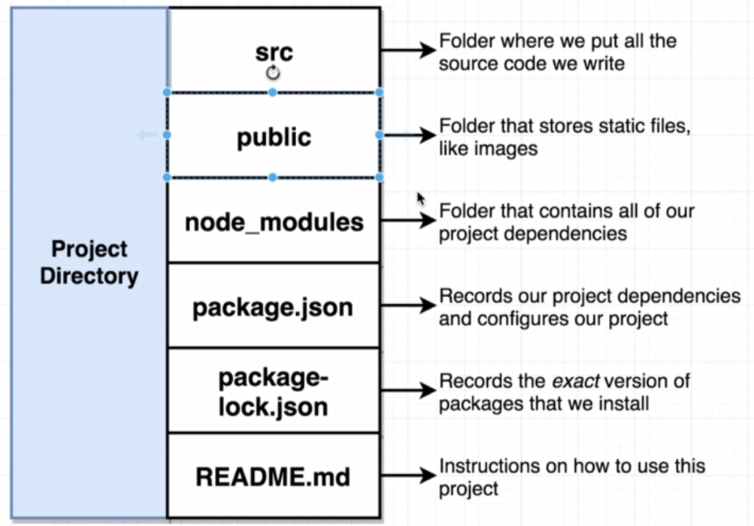

# Intro:

## 9 - Project Directory:



## 12 - Components:
- A component can either be a Function or a Class
- Primary purpose of a component is to produce HTML (i.e. jsx) to show the user
- Secondary purpose is to handle feedback from the user using Event Handlers

# Building Content with JSX

## JSX and Babel:
- Babel converts non-ES5 javascript code into ES5

| ES6 code   |
|------------|
```js
var App = function App() {
    return React.createElement("div", null, "Hi there!");
};
```
| Babel-converted ES5 code   |
|----------------------------|
```js
var App = function App() {
    return React.createElement("div", null, "Hi there!");
};
```


## JSX vs HTML:
| HTML Code  |
|------------|
```html
<div>
    <label class="label" for="name">Enter name:</label>
    <input id="name" type="text"/>
    <button style="background-color: blue; color:white">Submit</button>
</div>
```
| JSX code   |
|------------|
```js
<div>
    <label className="label" for="name">Enter name:</label>
    <input id="name" type="text" />
    <button style={{backgroundColor: 'blue', color: 'white'}}>Submit</button>
</div>
```

- By **REQUIREMENT**, JSX must use double-quotes for a string (e.g. "label", "name" etc)
- By **COMMUNITY CONVENTION**, use single-quotes for any non-JSX property

- When referring to styling, JSX has traditionally used `className` instead of `class`, though reasons for this are just legacy at this point
- JSX can access Javascript properties using curly-brackets:
  - If wanting to access JS **Objects** within JSX, they need to either be:
    - Referred explicitly if wanting to retreive their value (e.g. someObject.foo)
    - Assigned to another property (e.g. className = someObject)


# Communicating with Props

## Three Tenets of Components
- Component Nesting: a component can be shown inside of each other
- Component Re-usability: components should be easily re-usable
- Component Configuration: components should be customisable when they're created (when re-using components)

## Free CSS Styling from Semantic
- semantic-ui.com offers free css styles for common components
- To use these:
  - https://cdnjs.com/libraries/semantic-ui
  - copy https://cdnjs.cloudflare.com/ajax/libs/semantic-ui/2.4.1/semantic.min.js
  - Add the following line inside <head> of index.html:
    - <link rel="stylesheet" href="https://cdnjs.cloudflare.com/ajax/libs/semantic-ui/2.4.1/semantic.min.css" />

## Fake Data / Assets Generation:
- https://github.com/marak/Faker.js/ can be used to generate fake data and images
- To use within a react project:
  - `npm install --save faker` -> installs but also adds the module to package.json for future need
  - `import faker from 'faker';`
  - See documentation and use as a 'path' to generating the required data, e.g.
  - NOTE: ensure the final string is given () to signify a method call